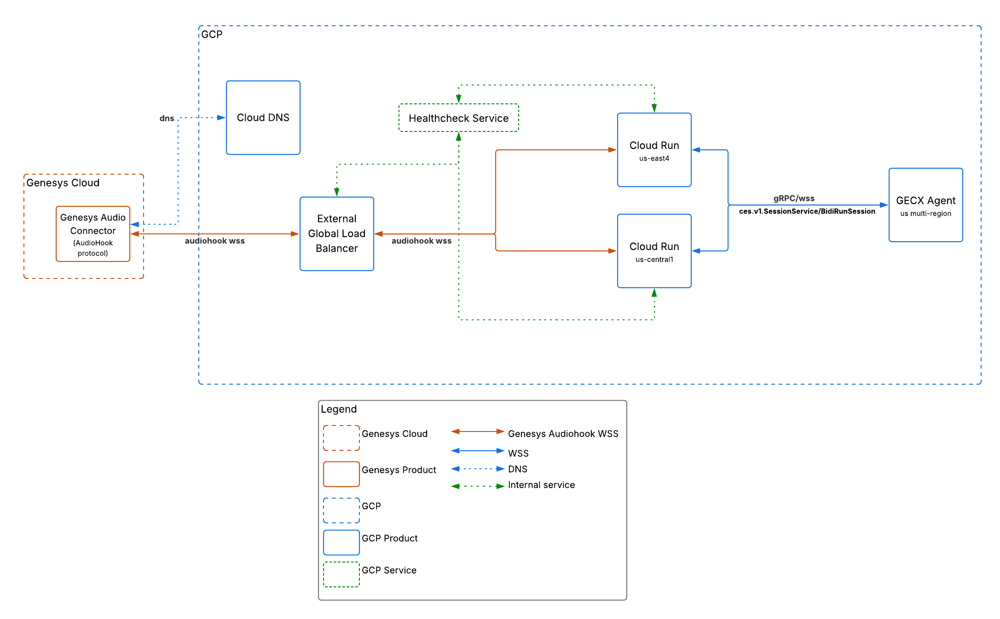

# 

# CES Genesys Adapter

## Applied AI - CCaaS Incubation - Reference Implementation

**Author(s)**: [Reni Migueltorena](mailto:migueltorenajr@google.com)  
**Contributor(s)**: [Igor Aiestaran](mailto:aiestaran@google.com), [Juanan Estival](mailto:estival@google.com), [Roberto Jung Drebes](mailto:drebes@google.com), [Andrew Harteveldt](mailto:aharteveldt@google.com), [Navjeet Sarai](mailto:sarainavjeet@google.com)  
**Last revision**: Feb 26, 2026

# Table of Contents

[**1. Solution Overview**](#1-solution-overview)

[**2. Solution Architecture**](#2-solution-architecture)

[2.1. High-level Components and Data Flow](#21-high-level-components-and-data-flow)

[2.2. High-level Architecture Diagram](#22-high-level-architecture-diagram)

[**3. IAM (Identity and Access Management)**](#3-iam-identity-and-access-management)

[**4. Reference Implementation Guide**](#4-reference-implementation-guide)

[4.1. Configuring Genesys Cloud](#41-configuring-genesys-cloud)

[4.1.1. Configure the Genesys Audio Connector integration](#411-configure-the-genesys-audio-connector-integration)

[4.1.2. Configuring the Audio Connector in Architect](#412-configuring-the-audio-connector-in-architect)

[4.1.3. Troubleshooting the Genesys Configuration](#413-troubleshooting-the-genesys-configuration)

[4.1.3.1. Genesys Cloud Operational Console](#4131-genesys-cloud-operational-console)

[4.1.3.2. Genesys Cloud Flow Execution History](#4132-genesys-cloud-flow-execution-history)

[4.2. Deploying GCP components](#42-deploying-gcp-components)

[4.2.1. Create the service accounts](#421-create-the-service-accounts)

[4.2.2. Create and deploy the Cloud Run application](#422-create-and-deploy-the-cloud-run-application)

[4.2.3. Set up Cloud DNS](#423-set-up-cloud-dns)

[4.2.4. Set up External Application Load Balancer](#424-set-up-external-application-load-balancer)

[4.2.5. Configure the backend service](#425-configure-the-backend-service)

[4.2.6. Set up Frontend & SSL](#426-set-up-frontend--ssl)

[4.2.7. Troubleshooting GCP components](#427-troubleshooting-gcp-components)

[4.2.7.1. CES Genesys Adapter Structured Logging](#4271-ces-genesys-adapter-structured-logging)

[4.2.7.2. Specific GCP components and General Cloud Logging](#4272-specific-gcp-components-and-general-cloud-logging)

[4.3. CX Agent Studio](#43-cx-agent-studio)

[4.3.1. Features supported by the adapter](#431-features-supported-by-the-adapter)

[4.3.2. Create a deployment for your agent](#432-create-a-deployment-for-your-agent)

[4.3.3. Mapping input variables from Genesys](#433-mapping-input-variables-from-genesys)

[4.3.4. Generating metadata that maps to output variables in Genesys](#434-generating-metadata-that-maps-to-output-variables-in-genesys)

[4.3.5. Troubleshooting CXAS sessions](#435-troubleshooting-cxas-sessions)
# 1. Solution Overview

This solution provides a Python-based adapter to bridge Genesys Cloud AudioHook WebSockets with Google Cloud's CX Agent Studio (“CXAS”), specifically utilizing the `BidiRunSession` API for real-time, bidirectional audio streaming and conversation management. This enables seamless integration of sophisticated virtual agents into a Genesys Cloud voice flow.

The adapter handles the WebSocket signaling, audio pacing (currently configured for Genesys-native 8kHz MULAW passthrough), DTMF relay, and session lifecycle management between the two platforms.

This reference implementation is based on the open-source code available on GitHub at [GoogleCloudPlatform/ces-genesys-adapter](https://github.com/GoogleCloudPlatform/ces-genesys-adapter). The code is published under the Apache License 2.0.

# 2. Solution Architecture

## 2.1. High-level Components and Data Flow

* **Genesys Cloud**: A suite of cloud services for enterprise-grade contact center management. It handles customer communications across voice, chat, email, and other channels. Developer center available [here](https://developer.genesys.cloud/).  
* **Genesys Audio Connector**: Initiates the AudioHook WebSocket connection to the adapter when a call enters the configured flow. Overview available [here](http://help.mypurecloud.com/articles/audio-connector-overview/).  
  * **Genesys AudioHook Protocol**: AudioHook is a mechanism and generic protocol to provide a near real-time stream of voice interactions from the Genesys Cloud platform to any third-party service endpoint. This enables partners and customers to extend the open Genesys Cloud platform with services that require monitoring voice interactions in near real-time, such as: passive biometrics, transcription, speech analytics, agent coaching, sentiment analysis, recording, etc. Specification available [here](https://developer.genesys.cloud/devapps/audiohook/).  
* **Google Cloud Network Layer**:  
  * **Cloud DNS:** Authoritative DNS zone resolving the domain to the Load Balancer IP. Documentation available [here](https://docs.cloud.google.com/dns/docs).  
  * **Global External Application Load Balancer (EALB):** Terminates the SSL connection at the edge. Overview available [here](https://docs.cloud.google.com/load-balancing/docs/https).  
  * **Google-Managed SSL Certificate:** Automatically provisioned and renewed certificate for the `audiohook` subdomain.  
  * **Proximity Routing:** The EALB automatically routes the WebSocket request to the Cloud Run region closest to the Genesys Media Server (e.g., routing US East traffic to `us-east4`).  
* **Cloud Run Service ([GoogleCloudPlatform/ces-genesys-adapter](https://github.com/GoogleCloudPlatform/ces-genesys-adapter))**: This application acts as a bridge between Genesys Cloud and Google's conversational AI services. It receives the real-time audio stream from a phone call via Genesys AudioHook, forwards that audio to your Google conversational agent for processing, and streams the agent's voice response back into the phone call. This creates a seamless, real-time conversation between the caller and your AI agent. It is a Python application, running on Cloud Run. Review the details for the adapter’s open source software [here](https://github.com/GoogleCloudPlatform/ces-genesys-adapter/blob/main/README.md) and the Cloud Run documentation [here](https://docs.cloud.google.com/run/docs).  
  * **Serverless NEGs**: Network Endpoint Groups that allow the Load Balancer to address the serverless containers. Overview available [here](https://docs.cloud.google.com/load-balancing/docs/negs/serverless-neg-concepts).  
  * **Core Logic Flow**:  
    * Accepts WebSocket connections from Genesys AudioHook.  
    * Authenticates requests using Genesys signatures.  
    * Establishes a WebSocket connection to the Google CES BidiRunSession API.  
    * Streams audio from Genesys to CXAS agent.  
    * Streams audio responses from CXAS agent back to Genesys.  
    * Relays DTMF events from Genesys to CXAS agent.  
    * Manages session lifecycle messages (open, close, disconnect, etc.).  
* **Google Cloud CX Agent Studio**: Hosts the virtual agent, processes the audio stream, and generates responses. Documentation available [here](https://docs.cloud.google.com/customer-engagement-ai/conversational-agents/ps).  
* **Google Secret Manager**: Securely stores Genesys API keys and client secrets used for signature verification. Documentation available [here](https://docs.cloud.google.com/secret-manager/docs).

## 2.2. High-level Architecture Diagram

The reference implementation assumes a multi-region configuration for high-availability and redundancy.  


# 

# 3. IAM (Identity and Access Management)

IAM roles utilized for each step are documented below, it is important to ensure secure and controlled access of these call recording files:

1. Service Account (e.g., `ces-genesys-adapter@{YOUR_PROJECT_ID}.iam.gserviceaccount.com`):  
   * `roles/ces.client`: To interact with the Conversational Agents API (BidiRunSession).  
   * `roles/secretmanager.secretAccessor`: To access secrets stored in Secret Manager (e.g., GENESYS\_API\_KEY, GENESYS\_CLIENT\_SECRET).  
2. Services Access Policy:  
   * The Cloud Run service resource must allow unauthenticated ingress (`roles/run.invoker` granted to `allUsers`) to accept traffic from the Global External Load Balancer.

# 4. Reference Implementation Guide

This section will include the major steps and code examples used to deploy this reference implementation in Google Cloud. Prior to following the reference implementation, confirm that you meet the following prerequisites.

Prerequisites:

1. Google Cloud Project with billing enabled  
2. `gcloud` CLI installed and configured  
3. Genesys Cloud instance with Genesys Audio Connector added  
4. Genesys API Key and Client Secret stored in Google Secret Manager  
5. A deployed CX Agent Studio agent  
6. The following APIs enabled in your GCP Project: [Cloud Asset Inventory](https://docs.cloud.google.com/asset-inventory/docs/reference/rest), [Compute Engine](https://docs.cloud.google.com/compute/docs/reference/rest/v1), [Cloud Run](https://docs.cloud.google.com/run/docs/reference/rest), [Artifact Registry](https://docs.cloud.google.com/artifact-registry/docs/reference/rest), [Cloud Build](https://docs.cloud.google.com/build/docs/api/reference/rest), [Secret Manager](https://docs.cloud.google.com/secret-manager/docs/reference/rest), [Cloud Logging](https://docs.cloud.google.com/logging/docs/reference/v2/rest), [Gemini Enterprise for Customer Experience](https://docs.cloud.google.com/customer-engagement-ai/conversational-agents/ps/reference/rest/v1-overview), [Cloud DNS](https://docs.cloud.google.com/dns/docs/reference/rest/v1)

## 4.1. Configuring Genesys Cloud

This section describes the necessary steps for configuring the Genesys Cloud environment for this reference implementation, however it is not an exhaustive list of configurations for implementing Genesys Cloud as a contact center solution. 

### 4.1.1. Configure the Genesys Audio Connector integration

This section describes the necessary steps to configure the Audio Connector integration. In order to add the Genesys Audio Connector from AppFoundry ([here](https://appfoundry.mypurecloud.com/filter/genesyscloud/listing/a56d4a1a-241b-4fd7-9342-ccd9db6f837a)), you will need to work with your Genesys account team. 

Once the integration is available to your account, follow the steps below to configure the Audio Connector. 

1. Sign into your Genesys Cloud portal  
2. Select **Collaborate/Communicate**   
3. Select the **IT and Integrations** menu option  
4. Select the **Integrations** menu option  
5. Select **Add integration** and search the integrations for **Audio Connector**  
6. Select the **Install** option on the **Audio Connector**  
7. This will open a new configuration interface for a new **Audio Connector**  
   1. Under **Details**, provide an **Integration Name** and any **Notes** (optional)  
   2. Under **Configuration**, select **Properties** and input the **Base Connection URI**  
      1. The **Base Connection URI** is the WebSocket Secure (WSS) URL endpoint that reaches the adapter deployed in the regional Cloud Run instances. In this case, use the Global DNS URL generated in step 4.2.3 to ensure high availability and regional redundancy.  
   3. Under **Advanced**, the **Advanced Configuration** is optional and this reference implementation leaves this configuration null (e.g. `{}`).  
   4. Under **Credentials**, the **Audio Connector Credentials** need to be added.   
      1. The **API Key** and **Client Secret** added in this configuration need to be saved in **Secret Manager**.  
         * Note that the value entered for **API Key** needs to pass regular expression: `^[a-zA-Z0-9+/_-]+={0,2}$`  
         * Note that the value entered for **Client Secret** needs to be base64 encoded and must pass `^(?:[A-Za-z0-9+/]{4})*(?:[A-Za-z0-9+/]{3}=?|[A-Za-z0-9+/]{2}(?:==)?)?$`. An example command to generate this value in your terminal is `openssl rand -base64 32`.

Once the **Audio Connector** integration is configured, prior to advancing to section 4.1.2, you will need a DID Number available for assignment to the Flow created in the next step.

### 4.1.2. Configuring the Audio Connector in Architect

This section describes the minimum requirements to configure the [Audio Connector](http://help.mypurecloud.com/articles/audio-connector-overview/) in a Genesys flow for use with the [CES Genesys Adapter](https://github.com/GoogleCloudPlatform/ces-genesys-adapter) deployed in [Cloud Run](https://docs.cloud.google.com/run/docs).

Follow the steps below to configure the Audio Connector:

1. Sign into your Genesys Cloud portal  
2. Select **Architect**  
3. **Edit** an existing flow (or **Add** a new flow)  
4. Under **Starting Menu**, from **Actions**, add the **Task action** to the list of options  
5. Open the newly added **Task action** option under **Starting Menu**, and under **Bot** drag the **Call Audio Connector** option into your flow  
6. In the settings for **Call Audio Connector**  
   1. Select the audio connector **Integration Name** you configured in section 4.1.1.7a from the list  
   2. Input a **Connector ID** value (this is used when calling the Cloud Run WSS endpoint)  
   3. Under the **Session Variables \- Inputs**, click the plus (**\+**) sign to add variables from your flow that will be passed to the CXAS agent  
      1. Note that it is **required** to send the Deployment ID path from your CX Agent Studio (CXAS) agent as `_deployment_id` (see in section 4.3.2.7).  
      2. Any values added prefixed with an underscore (e.g. `_value`) will be ignored when passing data to CXAS; see table 4.1.2.1 for more details on supported values with prefixed underscore.  
      3. Other suggested, but optional, values that can be passed using the Genesys flow’s String Builder tool (from **Data**) are `Call.Ani` (user’s phone number), `Call.CalledAddressOriginal` (dialed phone number), `Call.ConversationId` (Genesys conversation ID). The **Variable Name** used in this configuration in the Genesys flow will be the key name for the session variable in the CXAS agent. For example, if you pass key `ani` with value of `Call.Ani` then the variable key in CXAS agent context will be **`ani`**.  
   4. Under **Session Variables \- Outputs**, click the plus (**\+**) sign to add variables that will be returned to your flow by CXAS agent `end_session` signal. See section 4.3.4 to identify the key names to add in this configuration.  
7. Select **Save** and **Publish** your flow.  
 


| Table 4.1.2.1 |  |  |  |
| :---- | :---- | :---- | ----- |
| Input variable key | Expected value | Purpose |  |
| `_deployment_id` | The deployment ID for the CXAS [deployed channel](https://docs.cloud.google.com/customer-engagement-ai/conversational-agents/ps/deploy) (see 4.3.2) | Used to call your deployed agent version via [ces.googleapis.com](http://ces.googleapis.com) |  |
| `_agent_id` | The CXAS agent app ID value (e.g. `/projects/PROJECT_ID/locations/REGION/apps/APP_ID`) | Used to call your agent via [ces.googleapis.com](http://ces.googleapis.com); Optional if `_deployment_id` is already being passed) |  |
| `_session_id` | As an example, write the Genesys conversation ID to this variable in the flow. | (Optional) Use a custom session ID for the CXAS agent conversation. If left `null` the adapter will use its session id (`adapter_session_id`). |  |
| `_initial_message` | Insert a phrase to insert at session creation to kickstart your agent’s first turn. | (Optional) The default adapter kickstart message is “Hello”, overwrite it with this input variable. |  |

### 4.1.3. Troubleshooting the Genesys Configuration

This section outlines the troubleshooting tools available in Genesys Cloud for the Audio Connector integration and flow configuration.

#### *4.1.3.1. Genesys Cloud Operational Console*

In order to troubleshoot errors with the integration related to the Audio Connector, you can use the Genesys Cloud **Operational Console** tool. The console displays error messages related to the AudioHook protocol. See the documentation for this tool [here](https://help.genesys.cloud/articles/troubleshoot-using-the-genesys-cloud-operational-console/).

#### *4.1.3.2. Genesys Cloud Flow Execution History*

In order to troubleshoot errors with the integration, which offers drill down into where in the flow the error occurred, you can use the **Flow execution history** tool. The execution history will pinpoint where in the flow an error occurred. See the documentation for this tool [here](https://help.genesys.cloud/articles/flow-execution-history/).

## 4.2. Deploying GCP components

This section describes the deployment of required GCP components used in this reference implementation. If your enterprise’s requirements vary from the reference implementation, you will need to consider the necessary changes to the steps in the section accordingly.

### 4.2.1. Create the service accounts

The Cloud Run service needs a [Google Cloud service account](https://docs.cloud.google.com/iam/docs/service-account-overview) to run as, which grants it permission to invoke the Gemini Enterprise for Customer Experience API and access secrets stored in Secret Manager. 

1. Create a service account:

```shell
gcloud iam service-accounts create [SERVICE_ACCOUNT_NAME] --display-name="Genesys Adapter Service Account"
```

   **Note:** Replace `[SERVICE_ACCOUNT_NAME]` with the name you’ve chosen for the service account, e.g. `ces-genesys-adapter`.

   

2. Grant the `roles/ces.client` role to your service account. This allows the adapter to automatically generate the necessary credentials to securely connect to your conversational agent.

```shell
gcloud projects add-iam-policy-binding [PROJECT_ID] \
    --member="serviceAccount:[FULL_SERVICE_ACCOUNT_EMAIL]" \
    --role="roles/ces.client"
```

   **Note:** Replace `[FULL_SERVICE_ACCOUNT_EMAIL]` with the principal email of the service account you created in **4.2.1.2**, e.g. `ces-genesys-adapter@{PROJECT-ID}.iam.gserviceaccount.com`

   

3. You also need to grant your service account access to the Genesys API key and client secret stored in Secret Manager. There are two modes of loading secrets on the application (see 4.2.2.1), however your service account will require these permissions regardless of the option chosen.

```shell
gcloud secrets add-iam-policy-binding [API_KEY_SECRET_NAME] \
    --member="serviceAccount:[FULL_SERVICE_ACCOUNT_EMAIL]" \
    --role="roles/secretmanager.secretAccessor"

gcloud secrets add-iam-policy-binding [CLIENT_SECRET_NAME] \
    --member="serviceAccount:[FULL_SERVICE_ACCOUNT_EMAIL]" \
    --role="roles/secretmanager.secretAccessor"
```

   **Note:** Replace `[FULL_SERVICE_ACCOUNT_EMAIL]` with the principal email of the service account you created in **4.2.1.2** and replace `[API_KEY_SECRET_NAME]` and `[CLIENT_SECRET_NAME]` with the names of the secrets you created for the Genesys Audio Connector API key and client secret, respectively.

At the end of this section, you will have a service account created with the appropriate permissions configured. You are responsible for ensuring the token in **Secret Manager** is valid and refreshed periodically. The adapter will simply read and use whatever token is stored there.

### 4.2.2. Create and deploy the Cloud Run application

The Cloud Run application uses open source software published to Google Cloud’s GitHub [here](https://github.com/GoogleCloudPlatform/ces-genesys-adapter). Once you have cloned the open source repository locally, follow the next steps to deploy the software to Cloud Run:

1. Navigate to the root of the repository and configure the deployment values in `script/values.sh` as follows:

```shell
#!/bin/bash

# Copyright 2025 Google LLC

# Licensed under the Apache License, Version 2.0 (the "License");
# you may not use this file except in compliance with the License.
# You may obtain a copy of the License at

#     https://www.apache.org/licenses/LICENSE-2.0

# Unless required by applicable law or agreed to in writing, software
# distributed under the License is distributed on an "AS IS" BASIS,
# WITHOUT WARRANTIES OR CONDITIONS OF ANY KIND, either express or implied.
# See the License for the specific language governing permissions and
# limitations under the License.

PROJECT_ID={PROJECT_ID}
SERVICE_NAME=ces-genesys-adapter
SERVICE_ACCOUNT={SERVICE_ACCOUNT_NAME}@${PROJECT_ID}.iam.gserviceaccount.com
CPU="8"
MEMORY="4Gi"
TIMEOUT=60m
MIN_INSTANCES="1"
MAX_INSTANCES="1"
CONCURRENCY="1000"
REGIONS=("us-central1" "us-east4")

# Genesys API Key Secret Path/Name
# Option 1: Secret Name (for Cloud Run Injection - Recommended)
export GENESYS_API_KEY_SECRET_PATH="your-genesys-api-key-secret-name"
# Option 2: Full Resource Path (for Runtime Fetching)
# export GENESYS_API_KEY_SECRET_PATH="projects/<PROJECT_ID>/secrets/<SECRET_ID>/versions/latest"

# Genesys Client Secret Path/Name
# Option 1: Secret Name (for Cloud Run Injection - Recommended)
export GENESYS_CLIENT_SECRET_PATH="your-genesys-client-secret-name"
# Option 2: Full Resource Path (for Runtime Fetching)
# export GENESYS_CLIENT_SECRET_PATH="projects/<PROJECT_ID>/secrets/<SECRET_ID>/versions/latest"

# AUTH_TOKEN_SECRET_PATH="projects/123456789012/secrets/my-secret-token-path"

# PHONE NUMBER MAPPING CONFIGURATION (see "Phone Number to Agent Mapping" section in README.md)
# Choose ONE of the following methods.
# 1. Firestore (recommended for production)
# NUMBERS_COLLECTION_ID="ces-twilio-adapter-mappings"
# 2. Local JSON file (for development/testing)
NUMBERS_CONFIG_FILE="number_mappings.json"
LOG_UNREDACTED_DATA="false" # Defaults to "false"; setting to "true" is only recommended for non-production environments for testing and debugging.
DEBUG_WEBSOCKETS="false" # Defaults to "false"; setting to "true" is only recommended for non-production environments for testing and debugging.
```

**Note**: There are two modes of loading secrets on the application:

1. The first mode is using Cloud Run’s native secret injection. This is the recommended approach used in this reference implementation.  
   2. The second mode is to have the application fetch the secrets at runtime using the path to the secret. 

2. Set your environment variables prior to deploying:

```shell
export PROJECT_ID="" # Add your GCP project ID
export PROJECT_NUMBER="" # Add your GCP project number
export SERVICE_ACCOUNT_NAME="" # Add the service account name from 4.2.1.2
export GENESYS_API_KEY_SECRET_NAME="" # Add the secret name for the Genesys API Key stored in Secret Manager
export GENESYS_CLIENT_SECRET_NAME="" # Add the secret name for the Genesys client secret stored in Secret Manager
```

3. Deploy the service:

```shell
bash script/deploy.sh
```

At the end of this section, you should have your Cloud Run application deployed in two regions (`us-central1` and `us-east4`) with the correct service account, environment variables and secrets mounted.

### 4.2.3. Set up Cloud DNS

This reference implementation utilizes a custom domain to provide a stable, global entry point for Genesys Cloud. This decouples the Genesys configuration from specific regional Cloud Run URLs.

1. Reserve a Global Static IPv4 Address

This IP address will be the single entry point for all Genesys traffic and will be associated with your Load Balancer. Using the gcloud CLI, execute the following command:

```shell
gcloud compute addresses create [LB_IP_NAME] \
    --ip-version=IPV4 \
    --global
```

**Note:** Replace `[LB_IP_NAME]` with a name for your IP resource, e.g. `genesys-lb-ip`. 

2. Create a [Cloud DNS Managed Zone](https://docs.cloud.google.com/dns/docs/zones/zones-overview)

If you do not already have a managed zone for your domain, create one to manage the DNS records. Using the gcloud CLI, execute the following command:

```shell
gcloud dns managed-zones create [ZONE_NAME] \
    --description="Managed zone for Genesys adapter" \
    --dns-name="[DOMAIN_NAME]." \
    --visibility="public"
```

**Note:** Replace `[ZONE_NAME]` with a descriptive name (e.g., `your-domains-zone`) and `[DOMAIN_NAME]` with your registered domain ending in a dot (e.g., `yourdomain.com.`). 

3. Create an [A Record](https://docs.cloud.google.com/dns/docs/records)

Point your desired subdomain (e.g., `audiohook`) to the static IP reserved in 4.2.3.1. Using the gcloud CLI, execute the following commands:

```shell
# Retrieve the reserved IP address
LB_IP=$(gcloud compute addresses describe [LB_IP_NAME] --global --format="get(address)")

# Start a DNS transaction
gcloud dns record-sets transaction start --zone="[ZONE_NAME]"

# Add the A record
gcloud dns record-sets transaction add $LB_IP \
    --name="[SUBDOMAIN].[DOMAIN_NAME]." \
    --ttl="300" \
    --type="A" \
    --zone="[ZONE_NAME]"

# Execute the transaction
gcloud dns record-sets transaction execute --zone="[ZONE_NAME]"
```

**Note:** Replace `[SUBDOMAIN]` with your chosen prefix (e.g., `audiohook`).

### 4.2.4. Set up External Application Load Balancer

The Load Balancer distributes incoming WebSocket traffic across the deployed Cloud Run regions using [Serverless Network Endpoint Groups (NEGs)](https://docs.cloud.google.com/load-balancing/docs/negs/serverless-neg-concepts).

Create a Serverless NEG for each region where you deployed the Cloud Run service (see section 4.2.2). This allows the Load Balancer to route traffic to your serverless containers. Using the gcloud CLI, execute the following commands:

```shell
# Create NEG for the first region (e.g., us-central1)
gcloud compute network-endpoint-groups create [NEG_NAME_REGION1] \
    --region=[REGION1] \
    --network-endpoint-type=serverless \
    --cloud-run-service=[SERVICE_NAME]

# Create NEG for the second region (e.g., us-east4)
gcloud compute network-endpoint-groups create [NEG_NAME_REGION2] \
    --region=[REGION2] \
    --network-endpoint-type=serverless \
    --cloud-run-service=[SERVICE_NAME]
```

**Note:** Replace `[NEG_NAME_REGION1]` and `[NEG_NAME_REGION2]` with descriptive names (e.g., `neg-central1`, `neg-east4`), `[REGION1/2]` with your GCP regions, and `[SERVICE_NAME]` with your Cloud Run service name (e.g., `ces-genesys-adapter`).

### 4.2.5. Configure the backend service

The Backend Service defines how the Load Balancer distributes traffic to the NEGs created in the previous step.

1. Create the Backend Service  
   * Replace `[BACKEND_SERVICE_NAME]` with a name for your backend service, e.g., `ces-genesys-adapter-backend`.

Using the gcloud CLI, execute the following command:

```shell
gcloud compute backend-services create [BACKEND_SERVICE_NAME] \
    --load-balancing-scheme=EXTERNAL_MANAGED \
    --global
```

**Note:** You will also need to update the default 30 second `timeout` on the load balancer to prevent the connection from dropping early in the agent conversation. This reference implementation used `6100` (e.g. 6100 seconds), however should be adjusted based on your use case.

2. Add Backend (NEGs)

Add the NEGs created in section 4.2.4 as backends to this service. Using the gcloud CLI, execute the following commands:

```shell
# Add the first region's NEG
gcloud compute backend-services add-backend [BACKEND_SERVICE_NAME] \
    --global \
    --network-endpoint-group=[NEG_NAME_REGION1] \
    --network-endpoint-group-region=[REGION1]

# Add the second region's NEG
gcloud compute backend-services add-backend [BACKEND_SERVICE_NAME] \
    --global \
    --network-endpoint-group=[NEG_NAME_REGION2] \
    --network-endpoint-group-region=[REGION2]
```

3. Configure Protocol and Logging

Set the protocol to HTTP/2 (required for efficient WebSocket handling) and enable logging for observability. Using the gcloud CLI, execute the following commands:

```shell
# Update protocol to HTTP2
gcloud compute backend-services update [BACKEND_SERVICE_NAME] \
    --global \
    --protocol=HTTP2

# Enable logging (100% sample rate recommended for initial testing)
gcloud compute backend-services update [BACKEND_SERVICE_NAME] \
    --global \
    --enable-logging \
    --logging-sample-rate=1.0
```

### 4.2.6. Set up Frontend & SSL

This final step configures the public-facing components: the URL map, the SSL certificate, and the forwarding rule that binds the IP address to your service.

1. Create a URL Map

Route all incoming traffic to your backend service. Using the gcloud CLI, execute the following command:

```shell
gcloud compute url-maps create [URL_MAP_NAME] \
    --default-service=[BACKEND_SERVICE_NAME]
```

**Note:** Replace `[URL_MAP_NAME]` with a name for your URL map, e.g., `genesys-adapter-url-map`.

2. Create a Google-managed SSL Certificate

Provision a certificate for your domain. Using the gcloud CLI, execute the following command:

```shell
gcloud compute ssl-certificates create [CERT_NAME] \
    --domains="[SUBDOMAIN].[DOMAIN_NAME]"
```

**Note:** Replace `[CERT_NAME]` with a name for your certificate (e.g., `genesys-adapter-cert`). 

It may take 10 to 60 minutes for the certificate status to change from `PROVISIONING` to `ACTIVE`. You can check the status using: 

```shell
gcloud compute ssl-certificates describe [CERT_NAME] --global --format="get(managed.status)"
```

3. Create a Target HTTPS Proxy

Combine the SSL certificate and URL map. Using the gcloud CLI, execute the following command:

```shell
gcloud compute target-https-proxies create [PROXY_NAME] \
    --ssl-certificates=[CERT_NAME] \
    --url-map=[URL_MAP_NAME]
```

**Note:** Replace `[PROXY_NAME]` with a name for your proxy, e.g., `genesys-https-proxy`.

4. Create the Global Forwarding Rule

This rule listens for HTTPS traffic on port 443 at your reserved IP address. Using the gcloud CLI, execute the following command:

```shell
gcloud compute forwarding-rules create [FORWARDING_RULE_NAME] \
    --load-balancing-scheme=EXTERNAL_MANAGED \
    --network-tier=PREMIUM \
    --address=[LB_IP_NAME] \
    --global \
    --target-https-proxy=[PROXY_NAME] \
    --ports=443
```

**Note:** Replace `[FORWARDING_RULE_NAME]` with a name for your forwarding rule, e.g., `genesys-https-forwarding-rule`.

5. Configure service network and security to allow Load Balancer traffic to Cloud Run

To enable network-level restriction, and restrict usage of the public URL of the Cloud Run service(s), you will need to update the service’s ingress policy to only allow traffic from the External Application Load Balancer. Using the gcloud CLI, execute the following commands:

```shell
gcloud run services update [SERVICE_NAME] \
    --region=[REGION1] \
    --ingress=internal-and-cloud-load-balancing

gcloud run services update [SERVICE_NAME] \
    --region=[REGION2] \
    --ingress=internal-and-cloud-load-balancing
```

Finally, ensure your Cloud Run services allow unauthenticated invocations so the Load Balancer can reach them (authentication is handled at the application layer via Genesys headers). Using the gcloud CLI, execute the following commands:

```shell
gcloud run services add-iam-policy-binding [SERVICE_NAME] \
    --region=[REGION1] \
    --member="allUsers" \
    --role="roles/run.invoker"

gcloud run services add-iam-policy-binding [SERVICE_NAME] \
    --region=[REGION2] \
    --member="allUsers" \
    --role="roles/run.invoker"
```

### 4.2.7. Troubleshooting GCP components

This section describes the logs available for troubleshooting the GCP components in the reference implementation.

#### *4.2.7.1. CES Genesys Adapter Structured Logging*

The adapter has been [updated](https://github.com/GoogleCloudPlatform/ces-genesys-adapter/blob/main/CHANGELOG.md) to generate structured JSON logs with Cloud Logging. In the structured logs, a field has been created `log_type` to help with identifying where things are happening and to give a specific key for querying logs.

You can filter logs in Cloud Logging using the `jsonPayload.log_type` field. Refer to the data dictionary:

* `init`: Application initialization.  
* `config`: Configuration loading and checks.  
* `auth`: Authentication events for incoming connections.  
* `auth_error`: Authentication failures.  
* `connection_start`: New WebSocket connection established.  
* `genesys_auth_success`: Successful authentication.  
* `genesys_recv`: Raw message received from Genesys.  
* `genesys_recv_parsed`: Parsed message from Genesys.  
* `genesys_recv_text`: Generic text message received (if not matching other types).  
* `genesys_send`: Message sent to Genesys.  
* `genesys_send_opened`: '`opened`' message sent to Genesys.  
* `genesys_open`: Genesys session open event.  
* `genesys_connection_closed`: Genesys WebSocket connection closed.  
* `genesys_disconnect_start`: Disconnect process initiated.  
* `genesys_disconnect_duplicate`: Attempted duplicate disconnect.  
* `genesys_send_disconnect`: 'disconnect' message sent to Genesys.  
* `genesys_send_closed`: '`closed`' message sent to Genesys.  
* `genesys_probe`: Detected connection probe from Genesys.  
* `genesys_ignore_binary`: Ignored binary message during disconnect.  
* `genesys_recv_dtmf`: DTMF received from Genesys.  
* `genesys_custom_config`: Custom config received from Genesys.  
* `genesys_recv_ping`: Received Ping from Genesys.  
* `genesys_send_pong`: Sent Pong to Genesys.  
* `genesys_websocket_error`: Specific WebSocket errors in Genesys connection.  
* `genesys_error`: General error in Genesys WebSocket handling.  
* `ces_connect`: Connection attempt to CES.  
* `ces_connect_error`: Error during CES connection.  
* `ces_send_config`: Config message sent to CES.  
* `ces_send_kickstart`: Kickstart message sent to CES.  
* `ces_send_audio`: Audio sent to CES.  
* `ces_send_dtmf`: DTMF sent to CES.  
* `ces_recv_audio`: Audio received from CES.  
* `ces_recv_text`: Text received from CES.  
* `ces_recv_interruption`: Interruption signal received from CES.  
* `ces_recv_endsession`: Session end event from CES.  
* `ces_recv_sessionoutput`: Other `sessionOutput` from CES.  
* `ces_send_ping`: Sent Ping to CES.  
* `ces_recv_pong`: Received Pong from CES.  
* `ces_pacer_start`: Audio pacer task started.  
* `ces_pacer_stop`: Audio pacer task stopped.  
* `ces_pacer_send`: Audio chunk sent to Genesys from pacer.  
* `ces_connection_closed`: CES WebSocket closed.  
* `ces_websocket_error`: Specific WebSocket errors in CES connection.  
* `ces_send_error`: Error sending message to CES.  
* `ces_recv_error`: Error receiving message from CES.  
* `ces_listener_error`: Error in CES listener task.  
* `ces_pacer_error`: Error in CES pacer task.  
* `*_unhandled`: Unhandled message type from Genesys or CES.  
* `*_error`: Indicates an error in the specified component (e.g., `genesys_send_error`, `ces_send_dtmf_error`)  
* `ws_client_error`: WebSocket client errors  
* `ws_server_error`: WebSocket server errors.  
* `main_task_error`: Errors in the main request handling task.  
* `config_error`: Errors during configuration loading.

If you have enabled websocket debugging with the `DEBUG_WEBSOCKETS` environment variable set to `“true”`, then the logs will include a `websocket_trace` nested JSON object. This structured information allows for easier filtering and analysis of WebSocket traffic in Cloud Logging, aiding in debugging connection issues, message content problems, and protocol misunderstandings. This is recommended for lower environments or as a debugging tool to identify issues with the websocket connections between Genesys and CXAS. Refer to the data dictionary:

* `direction`: (String) Indicates the message direction:  
  * `“inbound”`: Message received from the remote peer.  
  * `“outbound”`: Message sent to the remote peer.  
  * `“state”`: Internal state changes in the WebSocket library.  
  * `“event”`: Internal events in the WebSocket library.  
* `frame_type`: (String) For frame messages, specifies the type:  
  * `“TEXT”`: A text frame.  
  * `“BINARY”`: A binary frame.  
* `byte_length`: (Integer) The size of the frame data in bytes.  
* `data_preview`: (String) A preview of the frame's data content. For `TEXT` frames, this is the string content. For `BINARY` frames, this might be a placeholder or a brief representation. The preview is truncated to avoid overly long log entries.  
* `data_json`: (Object) Only present for `TEXT` frames. If the text content is successfully parsed as JSON, this field contains the resulting Python dictionary.  
* `data_json_status`: (String) Only present for `TEXT` frames. Indicates the result of attempting to parse the frame's text content as JSON:  
  * `"parsed"`: The content was successfully parsed, and the result is in `data_json`.  
  * `"decode_error"`: A `json.JSONDecodeError` occurred, meaning the content is not valid JSON. This can happen with non-JSON text messages or truncated JSON.  
  * `"not_attempted"`: JSON parsing was not attempted (e.g., for `BINARY` frames).

#### *4.2.7.2. Specific GCP components and General Cloud Logging*

To help you troubleshoot the specific components in your Genesys Adapter architecture using Cloud Logging and other GCP tools, here are the direct links to the relevant documentation.

1. Cloud DNS  
   * [Troubleshoot Cloud DNS](https://docs.cloud.google.com/dns/docs/troubleshooting)  
   * [Use logging and monitoring for Cloud DNS](https://docs.cloud.google.com/dns/docs/monitoring)  
2. External Application Load Balancer  
   * [Troubleshoot issues with external Application Load Balancers](https://docs.cloud.google.com/load-balancing/docs/https/troubleshooting-ext-https-lbs)  
   * [External Application Load Balancer logging and monitoring](https://docs.cloud.google.com/load-balancing/docs/https/https-logging-monitoring)  
3. SSL Certificates (Google-managed only)  
   * [Troubleshoot SSL certificates](https://docs.cloud.google.com/load-balancing/docs/ssl-certificates/troubleshooting)  
   * [Use Google-managed SSL certificates](https://docs.cloud.google.com/load-balancing/docs/ssl-certificates/google-managed-certs)  
4. Cloud Run  
   * [Troubleshoot Cloud Run issues](https://docs.cloud.google.com/run/docs/troubleshooting)  
   * [Introduction to Cloud Run troubleshooting](https://docs.cloud.google.com/run/docs/troubleshooting/overview)  
5. General Cloud Logging  
   * [View logs in the Logs Explorer](https://docs.cloud.google.com/logging/docs/view/logs-explorer-interface)

**Important**: If you are configuring Google [Cloud Armor](https://docs.cloud.google.com/armor/docs) in your environment, you will need to get the specific IP addresses that Genesys Audio Connector (`"service": "audio-connector"`) uses for your Genesys environment(s). These are unique by region. Visit the Genesys Help Center article [here](https://help.genesys.cloud/faqs/how-can-i-obtain-the-ip-address-range-for-my-region-where-audio-connector-protocol-requests-could-originate-from-so-that-i-can-add-it-to-my-allowlist/) and follow the instructions to retrieve the IPs that will need to be allowlisted in Cloud Armor. 

## 4.3. CX Agent Studio

This section describes the configurations in [CX Agent Studio](https://docs.cloud.google.com/customer-engagement-ai/conversational-agents/ps) (CXAS) that are relevant to the reference implementation. 

### 4.3.1. Features supported by the adapter

The adapter code supports various features of CXAS as it relates to the end-user experience, but does not support all. The table below contains the adapter’s supported features:

| Feature name | How to use | Supported by adapter |
| :---- | :---- | :---- |
| Barge-in / user interruptions | Enable in Agent application’s Settings, see documentation [here](https://docs.cloud.google.com/customer-engagement-ai/conversational-agents/ps/agent#agent-application-settings) | Yes |
| Session input: DTMF | Requires **customize\_response** [system tool](https://docs.cloud.google.com/customer-engagement-ai/conversational-agents/ps/tool/system) added in the agent | Yes |
| Session input: Variables | See sections 4.1.2.6.c and 4.3.3 | Yes |
| End session metadata | See sections 4.1.2.6.d and 4.3.4; requires **end\_session** [system tool](https://docs.cloud.google.com/customer-engagement-ai/conversational-agents/ps/tool/system) added in the agent | Yes |
| Ambient sounds | Not recommended with adapter | Partial (not recommended) |
| Event input(s) | [CES API specification supports events input](https://docs.cloud.google.com/customer-engagement-ai/conversational-agents/ps/reference/rpc/google.cloud.ces.v1#event) | No, however can consider adding if there are relevant user experience events to process from [AudioHook protocol](https://developer.genesys.cloud/devapps/audiohook/protocol-reference#event-entity-types) to pass to CXAS agent. |

**Note:** that the features in the list above are specific to [SessionInput](https://docs.cloud.google.com/customer-engagement-ai/conversational-agents/ps/reference/rpc/google.cloud.ces.v1#sessioninput) and [SessionOutput](https://docs.cloud.google.com/customer-engagement-ai/conversational-agents/ps/reference/rpc/google.cloud.ces.v1#sessionoutput) methods of the CES API. The [Ambient sounds](https://docs.cloud.google.com/customer-engagement-ai/conversational-agents/ps/agent#agent-application-settings) feature, while not explicitly specified in the API, does not work well with the adapter’s reference implementation due to audio frame limits with the AudioHook protocol.

### 4.3.2. Create a deployment for your agent

CX Agent Studio offers [deployment channels](https://docs.cloud.google.com/customer-engagement-ai/conversational-agents/ps/deploy) for your agent. In the reference implementation, the deployment channel used is [API connection](https://docs.cloud.google.com/customer-engagement-ai/conversational-agents/ps/deploy/api-access). The deployment ID that is generated by creating a deployment channel is used when configuring the `_deployment_id` input variable in the audio connector settings of the Genesys flow builder.

To create the deployment channel:

1. Go to [ces.cloud.google.com](http://ces.cloud.google.com)   
2. Select your project and agent  
3. Select the **Deploy agent** (e.g. 🚀 / rocket launch icon option in the top right corner of the agent builder interface)  
4. Select **New channel**  
5. Choose **Set up API access**  
   1. Input **Name**  
   2. Under **Agent Version**, select **Create new version**  
6. Select **Create channel**  
7. Copy the **Deployment ID** path from the **Channel created** confirmation modal  
   1. The complete path of the deployment id is structured as: `projects/YOUR_PROJECT_ID/locations/REGION/apps/APP_ID/deployments/DEPLOYMENT_ID`

The complete path needs to be saved as the value for the `_deployment_id` input variable configured in section 4.1.2.6.c. Note that you do not need to create a new deployment channel each time you update your agent, instead you can simply create a new version under your deployment ID configured by repeating step 5b above and selecting **Save**. This will ensure you can continue to use the deployment ID value you’ve configured in the Genesys flow.

### 4.3.3. Mapping input variables from Genesys

In section 4.1.2.6.c, you configured in the Audio Connector a set of optional input variables to pass into the CXAS agent at runtime. This section describes how to configure the CXAS agent to consume the variables being passed.

If you are passing variables through the Audio Connector, they will need to be added in the CXAS agent’s [Variables](https://docs.cloud.google.com/customer-engagement-ai/conversational-agents/ps/variable) configuration. The key from Genesys input variables also needs to match the **Variable Name** in CXAS; note this is case sensitive. The **Variable Type** needs to match the data type that is being sent by Audio Connector. For example, if a phone number is passed in e164 format then it would be a **string** value which maps the **Text** type in CXAS. 

In the reference implementation, the audio connector input variables used are:

| Genesys key | Genesys value | CXAS Variable Name | CXAS Variable Type |
| :---- | :---- | :---- | :---- |
| ani | FlowData: `Call.Ani` | ani | Text |
| dnis | FlowData: `Call.CalledAddressOriginal` | dnis | Text |
| genesysId | FlowData: `Call.ConversationId` | genesysId | Text |

### 4.3.4. Generating metadata that maps to output variables in Genesys

In section 4.1.2.6.d, you configured in the Audio Connector a set of expected output variables to be returned to the flow when the CXAS agent calls the `end_session` [system tool](https://docs.cloud.google.com/customer-engagement-ai/conversational-agents/ps/tool/system). 

In order to generate the metadata associated with the `end_session` tool call, and subsequent API event, you must construct a `params` object prior to calling the `end_session` system tool.

Your developer(s) may come up with other methods to do this in your specific agent, however the reference implementation used a [Python code tool](https://docs.cloud.google.com/customer-engagement-ai/conversational-agents/ps/tool/python) and instructions that had this tool called prior to calling the `end_session` system tool. 

The code snippet example below was used in the reference implementation (`construct_end_session_args`):

```py
from typing import Dict, Any, Optional

def construct_end_session_args(
    outcome: str,
    escalation_reason: Optional[str] = None,
    genesys_variables: Optional[Dict[str, Any]] = None
) -> Dict[str, Any]:
    """
    Constructs the correct arguments for the 'end_session' tool based on conversation outcome.

    This tool ensures that data is correctly formatted for the CES-Genesys adapter,
    mapping 'genesys_variables' to the 'params' argument which the adapter converts
    to Architect Output Variables. Includes default params if genesys_variables is not provided.

    Args:
        outcome (str): The result of the session. Options: "success", "escalate".
        escalation_reason (str, optional): Recommended if outcome is "escalate".
                                           A short string describing why (e.g., "max_retries", "user_request").
        genesys_variables (dict, optional): Key-value pairs to pass back to Genesys Cloud.
                                            These keys MUST match the Output Variable names in your Architect Flow.
                                            If provided, these will merge with and override the default params.

    Returns:
        Dict: A dictionary of arguments ready to be passed to the 'end_session' tool.
    """

    tool_args = {
        "reason": "success",  # Default
        "session_escalated": False,
        "params": {}
    }

    # 1. Handle Outcome and Reason
    if outcome.lower() == "escalate":
        tool_args["session_escalated"] = True
        tool_args["reason"] = escalation_reason if escalation_reason else "escalate_to_human"
    elif outcome.lower() == "success":
        tool_args["reason"] = "success"
        tool_args["session_escalated"] = False
    else:
        # Fallback for any other outcome string
        tool_args["reason"] = outcome
        tool_args["session_escalated"] = False # Default

    # 2. Set Default Params based on outcome
    default_params: Dict[str, Any] = {}
    if tool_args["session_escalated"]:
        default_params = {
            "transferTarget": "SupportQueue",
            "escalationReason": tool_args["reason"],
            "priority": 10
        }
    elif tool_args["reason"] == "success":
        default_params = {
            "transferTarget": "SurveyFlow",
            "completionStatus": "Resolved",
            "priority": 0
        }

    # 3. Apply genesys_variables: User-provided values merge with and override defaults
    tool_args["params"] = default_params
    if genesys_variables is not None:
        tool_args["params"].update(genesys_variables)

    return tool_args

# ==========================================
# EXAMPLE USAGE WITH AGENT INSTRUCTIONS
# ==========================================

# Scenario: User wants to hang up
# Agent Instruction 1: Call construct_end_session_args
# outcome="success"
# end_session_payload = construct_end_session_args(outcome="success")
# Output of construct_end_session_args:
# {
#   "reason": "success",
#   "session_escalated": False,
#   "params": { "transferTarget": "SurveyFlow", "completionStatus": "Resolved", "priority": 0 }
# }
# Agent Instruction 2: Call end_session with the output
# tools.end_session(end_session_payload)

# Scenario: User wants to speak to an agent
# Agent Instruction 1: Call construct_end_session_args
# outcome="escalate", escalation_reason="customer_requested_human"
# end_session_payload = construct_end_session_args(outcome="escalate", escalation_reason="customer_requested_human")
# Output of construct_end_session_args:
# {
#   "reason": "customer_requested_human",
#   "session_escalated": True,
#   "params": { "transferTarget": "SupportQueue", "escalationReason": "customer_requested_human", "priority": 10 }
# }
# Agent Instruction 2: Call end_session with the output
# tools.end_session(end_session_payload)
```

**Note:** In order for the `params` to be included in the `end_session` tool, the instructions to call `end_session` must include the argument `session_escalated=true`.

### 4.3.5. Troubleshooting CXAS sessions

In order to troubleshoot CXAS sessions with the integration, it is recommended to enable the following:

1. In the Agent application **Settings**, select the **Advanced** tab, and select:   
   * Enable conversation logging  
   * Enable Cloud Logging  
   * Configure **Audio recording**  
2. In your GCP project’s **IAM & Admin** settings, go to **Audit Logging**, and enable the `DATA WRITE` audit logs for the **Customer Engagement Suite API**
